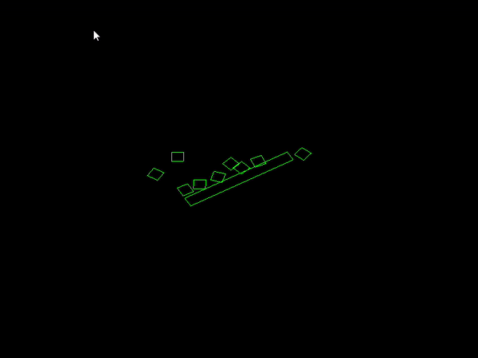

# CrunchMath
2D/3D math-physics engine for making games that shouldn't be shipped for production use and should only be used for physics simulations in debugging environment. Its main purpose is to show the low level details that goes behind making physics simulated environments in games or any software that requires it.

## Details:
### Features implemented so far are:
* Cmake support
* Math Engine with support for (Matrix, Vectors, Quaternions)
* Math Engine Collision Detection (AABB-AABB, OBB-Sphere, OBB-OBB, Sphere-Sphere)
* Body Newtonian Motion Simulation
* Physics Engine Collision Detection (Box-Box => {OBB-OBB})
* Contact Resolution using body contact re-positioning & velocity resolving approach 
* TestBed2D with graphical representaion of simulations using Opengl graphics API to render

### Features to be implemented:
* Bounding Volume Hierarchy (BVH)
* 3D Math SIMD operations to support (3x3 matrix, 3 unit vector, and quaternions)
* Physics Engine Collison Detection (Box-Sphere, Sphere-Sphere, Sphere-Plane, Box-Plane) 
* Ray Casting (Box, Sphere)
* Rope Physics
* Cloth Physics
* Ragdoll Physics
* UserInterface/Level Editor
* GJK/EPA Collision Detection/Resolution for complex polygons
* TestBed3D
* Custom Build MeshLoader
* Custom Build BMP Texture Loader

## More Detailed Roadmap of CrunchMath:
* [Project Todo's, Inprogress & Backlogs](https://github.com/users/harlexkhal/projects/1)

## Getting Started
These instructions will get you a copy of the project up and running on your local machine for development and testing purposes.

### Prerequisites
The basic requirements for building the executable are:

* CMake 3.8+
* C++ compiler

#### Cloning the project
```
git clone --recursive https://github.com/harlexkhal/CrunchMath <Your-Build-Directory>
```

### Building project with Cmake and building binaries
This program has been tested on Windows 10 and binaries built with visual studio 2019. but should work under any system that fulfils the aforementioned requirements.

#### Building Project Solution Files
Make sure to set the environmental path variable of cmake. then on the parent directory of the project using cli. run

```
cmake .
```
Project files are created. open with any c++ supported compiler, build and run.

Screenshot along the way of developing:


## Author
* **Alexander Ibeh** - [harlexkhal](https://github.com/harlexkhal)
